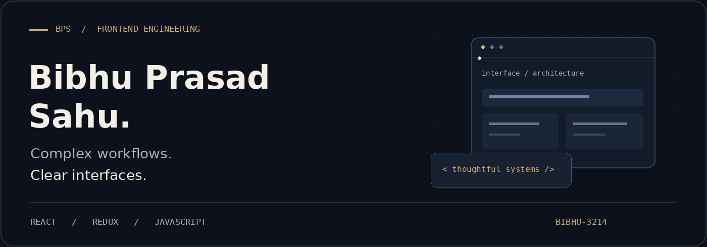
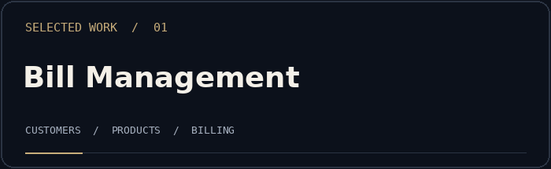
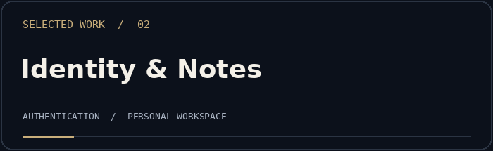

<picture>
  <source media="(prefers-reduced-motion: reduce)" srcset="./assets/profile-banner.png" />
  
</picture>

  <a href="#selected-work">Selected work</a> &nbsp; / &nbsp;
  <a href="#engineering-perspective">Engineering perspective</a> &nbsp; / &nbsp;
  <a href="https://www.linkedin.com/in/bibhu-prasad-sahu-8a1908199/">LinkedIn</a> &nbsp; / &nbsp;
  <a href="https://twitter.com/bibhu1prasad">X</a>

 

### Software engineer. Frontend focus.

I’m **Bibhu Prasad Sahu**, a Software Engineer at **GyanSys Inc.**, working with **React, Redux and JavaScript**. My experience includes enterprise application interfaces in the semiconductor domain.

I’m interested in the decisions behind a useful interface: how components fit together, where state belongs, and how people move through complex workflows. My aim is to make those decisions clear in both the product and the code.

 

## Selected work

Personal projects exploring practical application workflows. Each repository contains its implementation and setup details.

<table>
<tr>
<td width="50%" valign="top">

Customer, product and billing workflows in a browser-based React application.

<strong>Explore:</strong> connected CRUD flows, form validation, Redux state and browser-local persistence.

<code>React</code> <code>Redux</code> <code>Material UI</code> <code>Formik</code>

<a href="https://github.com/bibhu-3214/Bill-Management-App"><strong>Read the code ↗</strong></a>

Frontend-only personal project; not a production financial service.
</td>
<td width="50%" valign="top">

Registration, sign-in and account details connected to a personal notes workflow.

<strong>Explore:</strong> authenticated navigation, API interactions, validation and note management.

<code>React</code> <code>Redux</code> <code>React Router</code> <code>Axios</code>

<a href="https://github.com/bibhu-3214/user-authentication-react-redux"><strong>Read the code ↗</strong></a>

Personal application project; see the repository for its scope.
</td>
</tr>
</table>

<a href="https://github.com/bibhu-3214?tab=repositories">Browse all repositories →</a>

## Engineering perspective

**01 — Make complexity understandable.** Give components clear responsibilities and keep data flow explicit.

**02 — Design around the workflow.** Consider navigation, form feedback and the transitions between application states.

**03 — Improve with evidence.** Performance, accessibility and maintainability are areas I care about developing and measuring.

<strong>Open the technical toolkit</strong>

 

| Focus | Technologies |
| :--- | :--- |
| Frontend | JavaScript (ES6+), React, Redux, HTML, CSS |
| State & integration | Redux Thunk, React Router, Axios |
| UI & forms | Material UI, Bootstrap, Formik, Yup |
| Development | Git, GitHub, Postman |
| Exploring | TypeScript, Next.js, Node.js |

 

## Let’s connect

For conversations about **React engineering, frontend architecture, technical writing or collaborative projects**, connect with me on LinkedIn.

**[LinkedIn ↗](https://www.linkedin.com/in/bibhu-prasad-sahu-8a1908199/)** &nbsp; · &nbsp; **[X / Twitter ↗](https://twitter.com/bibhu1prasad)**

---

BIBHU PRASAD SAHU &nbsp; / &nbsp; FRONTEND ENGINEERING Clarity in the interface. Intent in the implementation.

